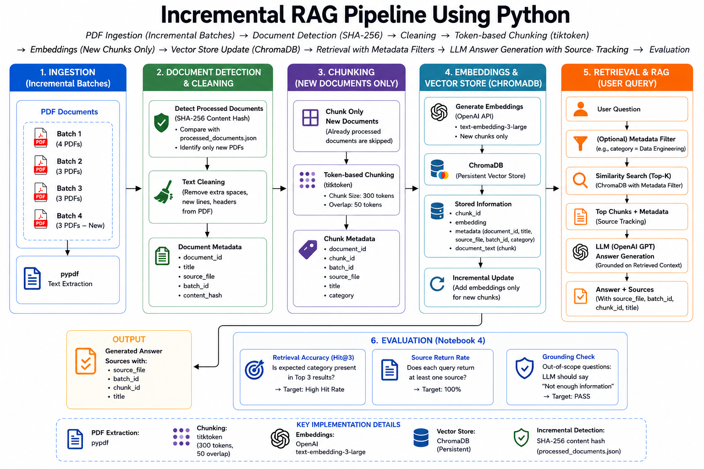

# Incremental RAG Pipeline Using Python

## Overview

This project implements an incremental Retrieval-Augmented Generation (RAG) pipeline using Python. Technical PDF documents are ingested in batches, cleaned, chunked, converted into embeddings, and stored in a persistent ChromaDB vector store.

The pipeline tracks previously processed documents using SHA-256 content hashes and document registries. When a new batch arrives, only new documents are detected, chunked, embedded, and added to the existing vector store instead of rebuilding the complete knowledge base.

The project was initially built using 10 technical PDFs across 3 simulated batches. A fourth batch containing 3 additional PDFs was later added and successfully processed to validate the incremental ingestion and vector-update logic.

## Tech Stack

- Python
- Jupyter Notebooks
- OpenAI API
- ChromaDB
- pypdf
- tiktoken
- python-dotenv

## Architecture



### Pipeline Flow

**PDF Batches → Text Extraction & Cleaning → Incremental Detection → Chunking → Embedding Generation → ChromaDB → Semantic Retrieval → Grounded LLM Generation → Source Traceability → Evaluation**

## Project Workflow

### 1. Incremental Document Ingestion

- Reads PDF documents from batch folders.
- Extracts text from PDFs using `pypdf`.
- Cleans document headers, page numbers, embedded metadata, and unnecessary whitespace.
- Generates SHA-256 hashes to identify document content.
- Maintains stable document IDs using a document registry.
- Tracks previously processed documents.
- Automatically identifies the next unprocessed batch.
- Writes newly detected documents for downstream processing.
- Maintains ingestion audit information including batch ID, document counts, and processing timestamp.

### 2. Chunking and Embedding Generation

- Loads only newly detected documents.
- Tokenizes document text using `tiktoken`.
- Splits text into 300-token chunks with 50-token overlap.
- Maintains chunk metadata including document ID, title, category, source file, batch ID, and chunk ID.
- Generates embeddings using OpenAI `text-embedding-3-large`.
- Adds only new chunks to the persistent ChromaDB collection.
- Updates processed-document tracking after successful storage.

### 3. Incremental Vector Store

ChromaDB is used as the persistent vector store.

Previously stored vectors remain available when a new batch is processed. Only embeddings generated for newly detected chunks are added to the collection, avoiding unnecessary regeneration of embeddings for previously processed documents.

### 4. Retrieval and RAG

The retrieval notebook provides an interactive RAG workflow.

- Accepts a user question.
- Generates an embedding for the question.
- Performs Top-3 semantic similarity search against ChromaDB.
- Supports an optional category-based metadata filter.
- Retrieves the most relevant chunks and their metadata.
- Sends the retrieved context to OpenAI `gpt-5.4-mini`.
- Instructs the model to answer only from the retrieved context.
- Returns the generated answer together with source file and chunk information.

### 5. Source Traceability

Each retrieved result maintains metadata that allows the response to be traced back to the source document.

Tracked information includes:

- Source file
- Document ID
- Chunk ID
- Category
- Batch ID

This provides lineage between the generated response, retrieved chunks, and original PDF documents.

### 6. Evaluation

The RAG pipeline was evaluated using five in-scope technical questions and one out-of-scope question.

Three evaluation checks were implemented:

**Retrieval Hit@3**  
Checks whether the expected category appears within the Top-3 retrieved chunks for each in-scope question.

**Source Return Rate**  
Checks whether retrieval returns source information for each evaluation question.

**Out-of-Scope Grounding Check**  
Uses a question outside the document knowledge base to verify that the LLM does not generate an unsupported answer when the retrieved context is insufficient.

### Evaluation Results

| Evaluation Check | Result |
|---|---:|
| Retrieval Hit@3 | 100% |
| Source Return Rate | 100% |
| Out-of-Scope Grounding Check | PASS |

## Incremental Processing Validation

The initial knowledge base contained:

- `batch_1` – 4 PDFs
- `batch_2` – 3 PDFs
- `batch_3` – 3 PDFs
- **10 documents total**

After the initial pipeline was completed, a new `batch_4` containing 3 additional technical PDFs was added:

- Apache Airflow
- Apache Kafka
- Data Lakehouse Architecture

The pipeline successfully detected `batch_4` as new input and processed the newly added documents through the incremental ingestion and embedding flow without rebuilding the previously processed knowledge base.

After Batch 4, the dataset contains **13 technical PDF documents across 4 batches**.

This validates the core incremental-processing behavior of the project.

## Project Structure

```text
incremental-rag-pipeline/
│
├── data/
│   ├── batch_1/
│   ├── batch_2/
│   ├── batch_3/
│   └── batch_4/
│
├── audit/
│   ├── document_registry.json
│   ├── processed_documents.json
│   ├── ingestion_audit.json
│   ├── new_documents.json
│   └── new_chunks.json
│
├── vector_store/
│
├── notebooks/
│   ├── 1_ingestion.ipynb
│   ├── 2_chunking_embeddings.ipynb
│   ├── 3_retrieval_rag.ipynb
│   └── 4_evaluation.ipynb
│
├── architecture/
│   └── architecture.png
│
├── .env
├── .gitignore
├── requirements.txt
└── README.md
```

## Notebook Execution Order

Run the notebooks in the following order:

1. `1_ingestion.ipynb`
2. `2_chunking_embeddings.ipynb`
3. `3_retrieval_rag.ipynb`
4. `4_evaluation.ipynb`

The current portfolio implementation is executed sequentially through notebooks. A scheduler or external orchestration framework is not used.

## Learnings

- Learned how to build an incremental RAG flow instead of reprocessing all documents every time.
- Understood how chunking, embeddings, ChromaDB, and semantic retrieval work together.
- Learned how metadata filters and source tracking improve retrieval.
- Tested grounded answers and out-of-scope questions to check RAG quality.

## Security

The OpenAI API key is loaded from a local `.env` file using environment variables.

The `.env` file and API credentials should never be committed to GitHub.
